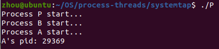
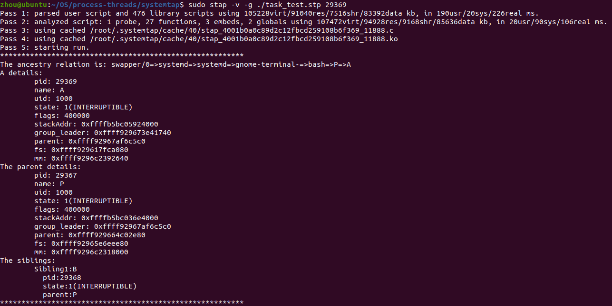

# SystemTap：追踪task_struct

## 实验

### 实验任务

​	现有一个正在运行的进程A及其父进程P和兄弟进程B，请根据进程A的PID，利用SystemTap提供的脚本语言及脚本库“tapset”，完成以下追踪任务：

* 找到进程A的所有祖先进程，并按顺序输出其进程名；
* 输出进程A的task_struct中的各个字段；
* 通过A的task_struct找到其父进程P的task_struct，并输出各个字段；
* 通过sibling链表找到兄弟进程B，并输出进程B的PID、状态及父进程名。

### 文件说明

  - P.c：fork出两个子进程，并分别execve可执行文件A和B（由A.c和B.c编译得到），得到两个子进程A和B，而后wait子进程A，进入阻塞态。
  - A.c：输出自身的PID，通过getchar()函数等待一个输入，进入阻塞态。
  - B.c：调用pause()函数进入阻塞态。
## 演示
### 编译文件
​	在当前目录下执行`make all`，生成A、B、P三个可执行文件。

### 演示过程
1. 在当前目录下运行程序P，即执行`./P`，进程P会调用进程A和进程B，并且进程P作为父进程。三个进程此时处于阻塞态，子进程A会输出自身的PID。
2. 新开一个终端，执行`sudo stap -v -g ./task_test.stp A_PID`，完成实验任务。

### 演示结果

1. 运行程序P。  

   

2. 利用SystemTap脚本执行追踪任务。  

    